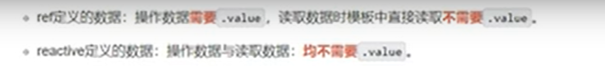
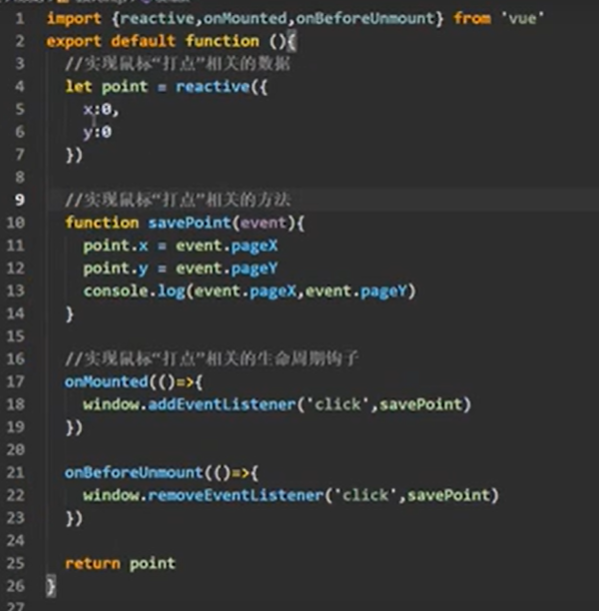
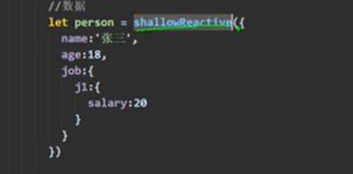

# 2021 8 6 vue3学习

## 安装

```shell
# 清除缓存
npm cache clean --force
C:\Users\Admin\AppData\Roaming\npm-cache 这下面的文件删掉

# 卸载 老版本vuecli
npm uninstall vue-cli -g

# 安装
cnpm install -g @vue/cli
npm install -g @vue/cli

# 查看安装成功版本
vue --version

# 升级cli
cnpm update -g @vue/cli
npm update -g @vue/cli

#创建项目
vue create testwabapp
可选 2 或者 3 创建
```

## vite构建

```shell
npm install -g create-vite-app
create-vite-app testwabapp
cd testwabapp
npm install
npm run dev
```


## 1 组合api


### 响应数据 里面层的属性 不用再次value ，job是一个proxy对象es6 window自带的


## 2 reactive 处理对象参数 响应式是深层次的


### 数组


### reactive真正的写法


### reactive  说明


### VUE3 响应式原理





## 3.emit用法

子组件必须绑定emits属性


父组件


## 4.attrs 就是 你传的props没用的话他给接住


## 5.插槽


## 6.计算属性

简写


复杂写法


## 7 watch

vue2里的 immediate 是 一上来就监视 deep 是深度监视 handler 是复杂监视

vue3

可以两个watch immediate 一开始就执行 deep 不用写 强制开启了深度监视，不用谢deep


reactive 不能直接交给 watch 不然新老数据会一样


需要 old value 用这个方法


监视 对象中的一个值


监视多个 用数组


监视对象 中的 对象


## 8 watcheffect 放里面的就监视 我不说我监视谁，你用谁我就监视谁


## 9 生命周期 hook钩子

销毁有变化


这两个时机一致  beforecreate 就是 setup， 所以不用写beforecreate在 setup里面。


## 10 新混入

js文件里面写逻辑  在 初始化的时候，给window添加click事件， 方法是savepoint，然后把point对象暴露出去



在组件里直接引入 hooks/usePoint 直接用，把所有的hooks放在一起，然后里面文件都叫useXXX，


组合api 就是在hooks里面体现的


## 11 toRef            把xx变成ref

把对象内的某个属性转化为 ref，你改变这个新的变量，就是响应式的


错误用法 这样就是把一个字符串打包成了新的ref 和原对象没关系了，应该是将原对象的属性变成ref


## 12 toRefs

可以把 对象里的属性拆散了 然后转ref交出去


## 13 shallowReactive 与 shallowRef   shallow的意思是浅层次

shallowReactive只考虑对象第一层的响应式，

使用场景： 针对对象的，对象只处理第一层



shallowRef 体现在你传入的是不是对象类型，如果是基本类型和ref一样，

如果是对象数据，深入不做响应式，

使用场景： 一般数据类型无所谓，对象第一层响应式。 


## 14 readonly 和 shallowReadonly

响应数据变成只读的，对reactive和ref生成的数据，做只读处理

shallowreadonly就是第一层做只读处理，对reactive处理，对ref不起作用因为没层次


使用场景 ，别人定义的，你不想改


## 15 把响应式数据变回原来，toRaw 与 markRaw


## 16 customRef 自定义 响应式

可以做到防抖，就是我一直点，他就出来一次想要的结果，

防抖 就是 有定时器就把定时器清掉，防抖


## 17 provider 祖宗 与 inject 孙子 间通讯  祖宗 ->后代

后代组件


祖宗组件


## 18  isRef isReactive isReadonly isProxy 判断


## 19  fragment teleport suspense 组件

fragment 就是 最外层不用写一个div了

teleport  弹出一个 窗口 像传送门


suspense 是异步组件 试验阶段


## 20 一些变化

全局 api 放在了 app上


路由 v-on  过滤器


